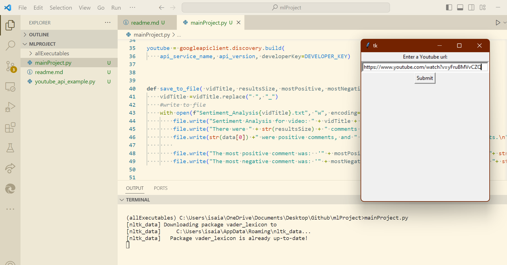
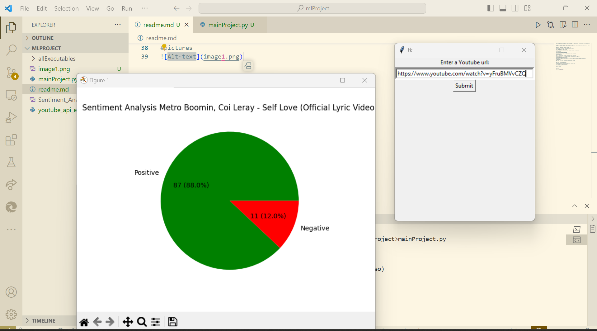
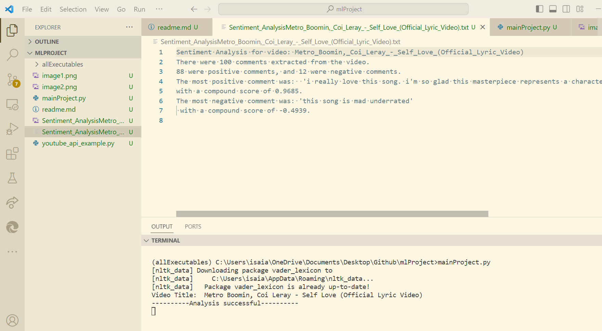
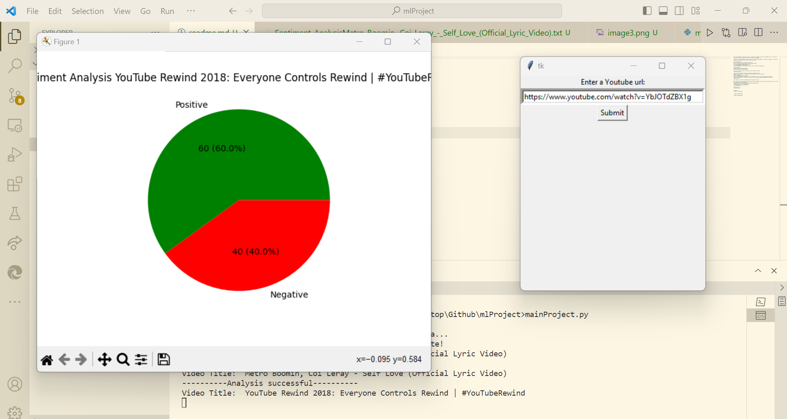
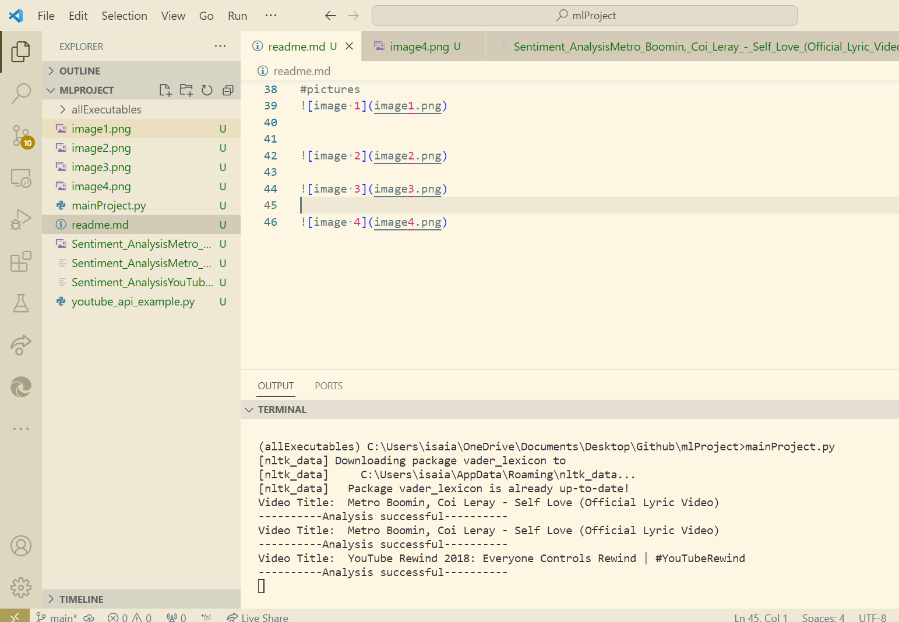

Goal: The purspose of the project was try creating a ML project without any knowlegde of ML. It was also to practice using Python because I recently learned the lanaguage.

I wanted to create a python ml project that will sort YouTube comments in positive or negative. From there I added a UI and saved the info into a file and an image

Environment setup:
First, you need to have a google cloud API key.
You will need to save this key to your local environment
To do so on Windows, Using Command Prompt:
setx YOUTUBE_API_KEY "YOUR_API_KEY"
replace "YOUR_API_KEY" with your actual key (don't include the quotations)

For macOS/Linux:
Temporary for the Current Session:
export YOUTUBE_API_KEY=YOUR_API_KEY

To verify if the key exist on windows you can follow this steps
System Properties:

You can set environment variables through the System Properties:
Right-click on "This PC" or "Computer" on your desktop or in File Explorer.
Select "Properties."
Click on "Advanced system settings."
In the System Properties window, go to the "Advanced" tab and click on "Environment Variables."
Under "User variables," click "New" and enter the variable name (YOUTUBE_API_KEY) and its value (YOUR_API_KEY)

Next, make you to close the command line and restart your IDE

Once that is done, you need to activate the virtual environment every time you open the project. This can be done using the following command:
To activate virtual environment using windows command prompt 
change directory to your virtual env 
$ cd <envname> i.e cd allExecutables
$ Scripts\activate 

Now you can run 
$ mainProject.py

#pictures

